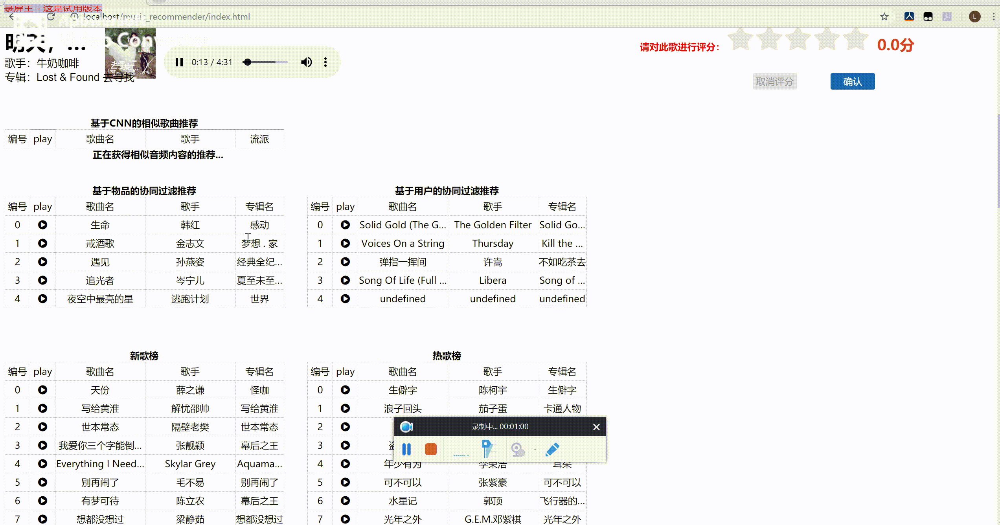
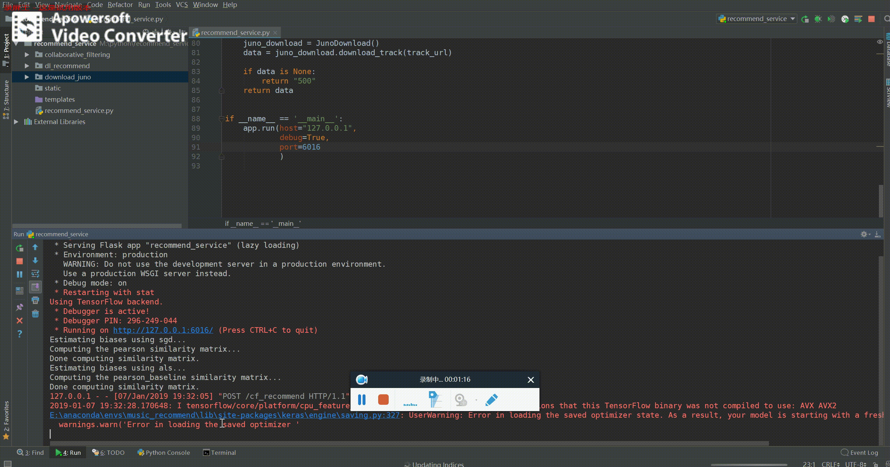

# 协同过滤音乐推荐 (Docker 部署）

协同过滤 音乐推荐 深度学习 音乐检索 Docker

---

@[toc]

## 介绍

项目主要工作在 `Million Song Dataset` 数据集下基于 `Python` 的 `scikit-surprise`  库实现了基于协同过滤的音乐推荐，还有用 CNN (卷积神经网络) 实现相似音乐推荐。

其中，协同过滤主要基于 Python `scikit-surprise` 库的 [文档(Documents)](https://surprise.readthedocs.io/en/stable/) 写的协同过滤算法， 所采用的数据集的原因，协同过滤出来的指标比较低，系统中协同过滤的结果采用三个算法输出的结果投票。

另外就是参照下面的参考项目做了基于深度学习的音乐推荐，该项目主要实现相似相似旋律的音乐推荐。其主要通过 CNN 对音乐音频信息进行特征提取，然后对提取后的特征向量与实现保存好的一些音乐特征向量进行相似度匹配，将相似度最高的几首音乐作为推荐结果。该方法可以用于音乐检索，音乐防抄袭等领域。

本项目特有的部分是，将上述两种方法融合，并写了个 web 展示效果。由于 `Million Song Dataset` 数据集没有歌曲内容信息，本人找了某易云的爬虫代码，建立 `Million Song Dataset` 数据集中的音乐 id 与 某易云的音乐 id 的映射（期间被封过 IP）。然后将音乐的内容进行时频转换后，送入卷积神经网络，得到歌曲特征向量，通过特征向量的相似度匹配，找出相似的音乐信息。

## 参考项目

1. 中文地址

    [私人定制——使用深度学习Keras和TensorFlow打造一款音乐推荐系统][1]

2. 英文地址

   [building a music recommender with deep learning][2]

## 微信小程序版实现

本项目的微信小程序版实现: [Github LE7ELS/music_recommendation_miniapp](https://github.com/LE7ELS/music_recommendation_miniapp)

## 技术栈

- Python Flask + Tensorflow + scikit-surprise
- PHP/MySQL/HTML/CSS/JQuery

## Docker 部署

### 依赖

- Docker
- Docker-compose

### 运行步骤

1. clone 此项目 `git clone git@github.com:MakingL/music_recommendation.git`, `cd music_recommendation`
2. 先 `git fetch --all`, 切换到分支 `git checkout docker-config`
3. 启动 docker 容器: `docker-compose up -d`
4. 导入数据库，PHPMyAdmin 导入 SQL 文件不能超过 2M，建议用 Navicat 导入

    - 浏览器访问 PHPMyAdmin: `http://localhost:8080/` (此处的地址 `localhost` 应根据实际情况而定)
    - `root` 用户密码: `tiger`
    - 新建数据库， 注意编码为 `utf8mb4`
      - 数据库名： `music_recommender`
      - 用户名： `music_system` (注意给权限)
      - 密码： `music_system`
    - 导入数据 `vender/DataBase/music_recommender.sql` 到该数据库

5. 在浏览器中访问网站 `http://localhost/`，预置的登录用户:

    - 用户名： `admin`， 密码： `admin123`
    - 用户名： `root`， 密码： `root1234`

## 运行界面

- 用户登录

- 协同过滤推荐

- 搜索歌曲

- 播放歌曲

- CNN推荐结果

## 相关资源推荐

1. [提供免费音乐的音乐库网站](https://www.yuque.com/ruanyf/share/free-music)

2. [推荐系统研究中的九大数据集](https://zhuanlan.zhihu.com/p/29416305)

3. [推荐系统基础知识 --- Github](https://github.com/apachecn/RecommenderSystems)

  [1]: https://yq.aliyun.com/articles/154475?spm=a2c4e.11153940.blogcont221660.38.fc258f9bDs7fml
  [2]: http://mattmurray.net/building-a-music-recommender-with-deep-learning/
  [3]: https://blog.csdn.net/qq_35547879/article/details/79700591
  [4]: https://codeday.me/bug/20180610/174453.html
  [5]: https://github.com/JoFrhwld/FAVE/wiki/Sox-on-Windows
  [6]: https://stackoverflow.com/questions/3537155/sox-fail-util-unable-to-load-mad-decoder-library-libmad-function-mad-stream
