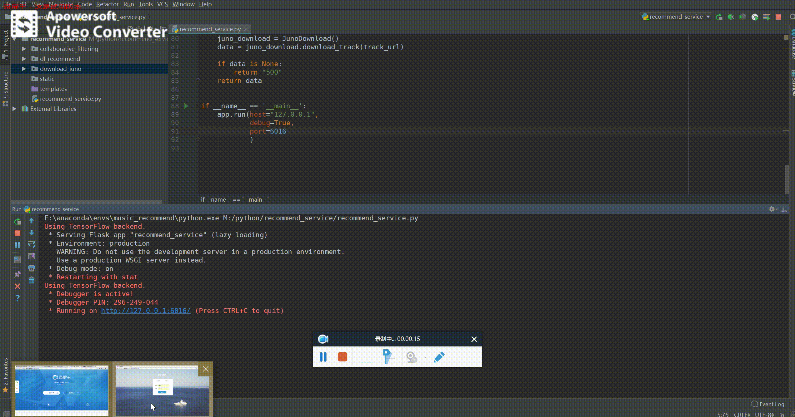
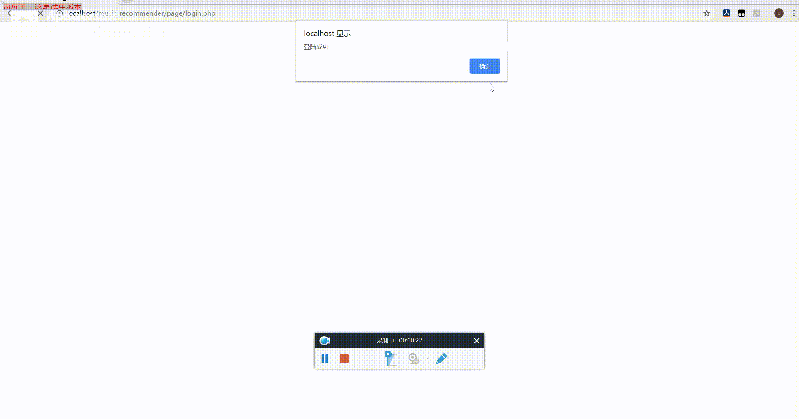
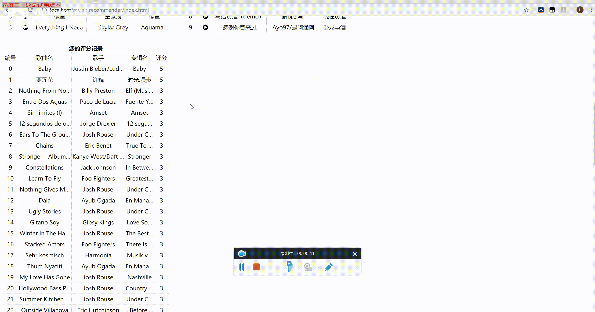
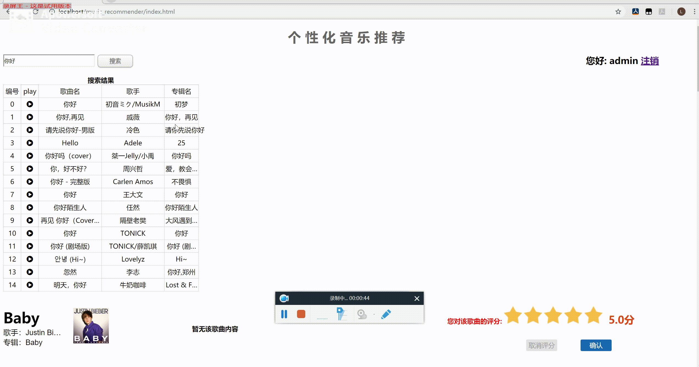

# 协同过滤音乐推荐

协同过滤 音乐推荐 深度学习 音乐检索

---

## 介绍

项目主要工作在 `Million Song Dataset` 数据集下基于 `Python` 的 `surprise` 库实现了基于协同过滤的音乐推荐，还有用 CNN (卷积神经网络) 实现相似音乐推荐。

## 参考项目

1. 中文地址

    [私人定制——使用深度学习Keras和TensorFlow打造一款音乐推荐系统][1]

2. 英文地址

   [building a music recommender with deep learning][2]

## 技术栈

- Python-Flask
- keras
- surprise
- PHP/MySQL
- HTML/CSS/JQuery

## 安装

### `Pyhton` 版本

Python 3.6.5

### `Python` 环境安装：

切换到 `recommend_service` 目录，`pip install -r requirements.txt`

### Web 环境：

需要安装 `LAMP` or `WAMP` 环境，即 Appache ，MySQL，PHP 服务器

### 音频处理软件 —— SOX

安装 `sox` 软件（sox 是开源的音频处理软件）
[SOX 安装教程][3]
[SOX 下载链接][4]
[加入系统环境][5]

#### 可能会出现的报错

`windows` 下 `Unable to load MAD decoder library (libmad) function`

解决方法可参考  [参考教程][6]

此报错只需下载相应的两个库文件，放到 `sox` 安装目录下

## 数据库--- MySQL

数据库名： `music_recommender`
用户名： `music_system`
密码： `music_system`
然后，导入 `music_recommender.sql` 文件中的数据

## 运行

1. 先运行 `recommend_service` 目录下的 `recommend_service.py` 文件，`python recommend_service.py`，Linux 下也可以运行命令 `nohup python recommend_service.py 2>&1 >dataOut.txt &`，让其后台执行
2. 将项目文件部署到 `Apache` www 目录下
3. 在浏览器中访问该网站

## 默认用户

1. 用户名： `admin`， 密码： `admin123`
2. 用户名： `root`， 密码： `root1234`

## 运行界面

- Python 程序启动

- 用户登录

- 协同过滤推荐

- 搜索歌曲

- 播放歌曲

- CNN推荐结果

  [1]: https://yq.aliyun.com/articles/154475?spm=a2c4e.11153940.blogcont221660.38.fc258f9bDs7fml
  [2]: http://mattmurray.net/building-a-music-recommender-with-deep-learning/
  [3]: https://blog.csdn.net/qq_35547879/article/details/79700591
  [4]: https://codeday.me/bug/20180610/174453.html
  [5]: https://github.com/JoFrhwld/FAVE/wiki/Sox-on-Windows
  [6]: https://stackoverflow.com/questions/3537155/sox-fail-util-unable-to-load-mad-decoder-library-libmad-function-mad-stream
